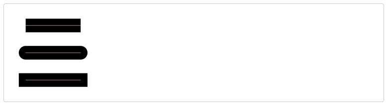

# SVG Rendering Fundamentals

## Stroke

### stroke-dasharray

- `stroke-dasharray="10 4"`
- stroke - gap - stroke - gap - ...
- https://developer.mozilla.org/en-US/docs/Web/SVG/Attribute/stroke-dasharray

### stroke-linecap

- `butt | round | square`
- https://developer.mozilla.org/en-US/docs/Web/SVG/Attribute/stroke-linecap

### stroke-linejoin

- `arcs | bevel | miter | miter-clip | round`
- https://developer.mozilla.org/en-US/docs/Web/SVG/Attribute/stroke-linejoin

## Linear Gradient

- https://developer.mozilla.org/en-US/docs/Web/SVG/Element/linearGradient

## d attribute

- https://developer.mozilla.org/en-US/docs/Web/SVG/Attribute/d
- `l`: line to (relative coordinate)
- `L`: line to (absolute coordinate)
- `h` and `H`: horizontal line
- `v` and `V`: vertical line